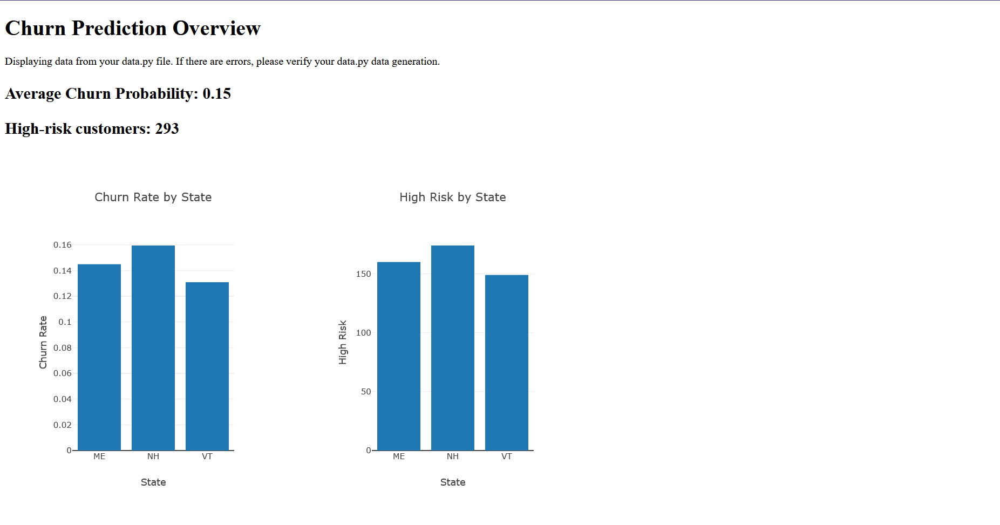

# Churn Prediction Dashboard

A Flask web application that analyzes customer churn data and displays insights through an interactive dashboard.

## Dashboard Preview



## Features

- Predicts customer churn using Logistic Regression
- Visualizes churn rates and high-risk customers by state
- Processes customer data with automated preprocessing
- Interactive dashboard using Plotly.js

## Project Structure

```bash
├── app.py              
├── data.py            
├── customer_data.csv  
└── templates/
    └── index.html    
```

## Technical Stack

- Python 3.x
- Flask
- Pandas
- Scikit-learn
- Plotly.js

## Setup & Running

1. Install dependencies:

```sh
pip install flask pandas scikit-learn
```

1. Run the application:

```sh
python app.py
```

1. Open [http://localhost:5000](http://localhost:5000) in your browser

## Key Features

- Customer data preprocessing
- Logistic Regression model for churn prediction
- State-wise churn analysis
- High-risk customer identification
- Interactive visualization

Note: To see the dashboard in action, run the application and navigate to [http://localhost:5000](http://localhost:5000)
